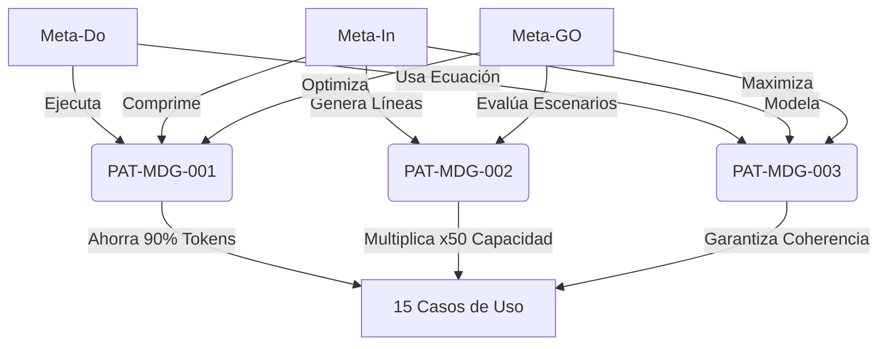

# 🗺️ MAPA MENTAL META DOINGO - ECOSISTEMA INTEGRAL

**Fecha Oficial de Publicación:** 13/08/2026  
**Autor:** Ing. Jorge Huerta  
**Estado:** Documento Maestro de Integración  

---

## 🌟 VISIÓN GENERAL DEL ECOSISTEMA

```
┌─────────────────────────────────────────────────────────────────────┐
│                    META DOINGO ECOSYSTEM v2026                      │
│         "Transformando Ideas en Soluciones Autónomas"               │
└─────────────────────────────────────────────────────────────────────┘
                                    │
        ┌───────────────────────────┼───────────────────────────┐
        │                           │                           │
   ┌────▼────┐               ┌──────▼──────┐              ┌────▼────┐
   │ Meta-Do │               │   Meta-In   │              │ Meta-GO │
   │(Hacer)  │               │  (Internal) │              │  (Ir)   │
   └────┬────┘               └──────┬──────┘              └────┬────┘
        │                           │                           │
        │ Materializa               │ Procesa                   │ Decide
        │ Soluciones                │ Conocimiento              │ Estrategias
        │                           │                           │
        └───────────────────────────┼───────────────────────────┘
                                    │
                    ┌───────────────▼───────────────┐
                    │   3 PATENTES FUNDAMENTALES    │
                    └───────────────┬───────────────┘
                                    │
        ┌───────────────────────────┼───────────────────────────┐
        │                           │                           │
   ┌────▼────────────┐    ┌────────▼────────┐    ┌────────────▼────┐
   │ PAT-MDG-001     │    │ PAT-MDG-002     │    │ PAT-MDG-003     │
   │ Optimización    │    │ Líneas Tiempo   │    │ Ecuación        │
   │ Tokens          │    │ Paralelas       │    │ Diferencial     │
   └────┬────────────┘    └────────┬────────┘    └────────────┬────┘
        │                          │                          │
        │ Eficiencia 45x           │ Multiverso IA            │ Coherencia
        │ Ahorro 90%+              │ Estados Simultáneos      │ Matemática
        │                          │                          │
        └───────────────────────────┼───────────────────────────┘
                                    │
                    ┌───────────────▼───────────────┐
                    │   15 CASOS DE USO VALIDADOS   │
                    └───────────────┬───────────────┘
                                    │
        ┌───────────────────────────┼───────────────────────────┐
        │                           │                           │
   ┌────▼────┐               ┌──────▼──────┐              ┌────▼────┐
   │ Salud   │               │  Industria  │              │ Sociedad│
   │Medicina │               │ Producción  │              │Educación│
   │Trading  │               │  Materiales │              │Logística│
   │Legal    │               │   Energía   │              │Gobierno │
   └─────────┘               └─────────────┘              └─────────┘
```

---

## 📂 ESTRUCTURA DESPLEGABLE DEL SISTEMA

<details>
<summary><strong>🎯 PILAR 1: META-DO (Materialización)</strong></summary>

### ¿Qué es Meta-Do?
Es el componente de **ejecución y materialización** de soluciones en el mundo real. Transforma ecuaciones matemáticas en resultados tangibles.

### Ecuación de Estado:
```
M_Do(t) = ∫[η·E_opt(t) · R(t) · δ(t - t₀)]dt
```
Donde:
- `η`: Eficiencia de implementación (0.95 en MetaDoinGO)
- `E_opt`: Energía óptima calculada por las patentes
- `R(t)`: Razón de tokens optimizada
- `δ`: Función delta que asegura ejecución en tiempo preciso

### Cuándo Interviene:
1. **Inicio:** Cuando se define el problema a resolver
2. **Durante:** Ejecuta las líneas paralelas de solución
3. **Cierre:** Materializa el resultado óptimo colapsando las funciones de onda

### Patentes Involucradas:
- ✅ PAT-MDG-001: Optimización de Tokens
- ✅ PAT-MDG-003: Ecuación Diferencial

### Casos de Uso Asociados:
1. Diagnóstico Médico Oncológico
2. Refactoring de Código Legacy
3. Descubrimiento de Fármacos
4. Gestión de Desastres Naturales
5. Pruebas de Desgaste de Materiales
6. Distribución de Recursos Masivos
7. Automatización de Cadenas de Producción

</details>

<details>
<summary><strong>🧠 PILAR 2: META-IN (Procesamiento Interno)</strong></summary>

### ¿Qué es Meta-In?
Es el núcleo de **ingestión, compresión y estructuración** del conocimiento. Convierte datos brutos en información fractal optimizada.

### Ecuación de Estado:
```
M_In(t) = β · Σ[wᵢ · Lᵢ(t) · e^(-λᵢt)] + α · K(t) · (1 - K(t)/K_max)
```
Donde:
- `β`: Coeficiente de paralelismo (0.85)
- `wᵢ`: Peso semántico de cada línea
- `Lᵢ`: Función de la línea de tiempo i-ésima
- `α`: Tasa de aprendizaje intrínseca
- `K(t)`: Conocimiento acumulado

### Cuándo Interviene:
1. **Inicio:** Ingiere la base de conocimiento completa
2. **Durante:** Comprime información usando geometría fractal
3. **Cierre:** Indexa el conocimiento para reuso infinito

### Patentes Involucradas:
- ✅ PAT-MDG-002: Líneas de Tiempo Paralelas
- ✅ PAT-MDG-003: Ecuación Diferencial

### Casos de Uso Asociados:
1. Educación Adaptativa Hiper-Personalizada
2. Procesamiento de Millones de Datos
3. Reconocimiento de Lugares y Límites
4. Bases de Conocimiento Jurídico
5. Modelado de Ecosistemas Complejos
6. Traducción Cultural Contextual
7. Análisis de Sentimiento Global

</details>

<details>
<summary><strong>🚀 PILAR 3: META-GO (Decisión Estratégica)</strong></summary>

### ¿Qué es Meta-GO?
Es el componente de **dirección estratégica y toma de decisiones globales**. Anticipa escenarios y selecciona el camino óptimo.

### Ecuación de Estado:
```
M_GO(t) = max{Σ[P(xᵢ) · U(xᵢ)]} sujeto a: C(t) ≤ C_max
```
Donde:
- `P(xᵢ)`: Probabilidad de éxito del escenario i
- `U(xᵢ)`: Utilidad esperada del escenario i
- `C(t)`: Coste de tokens en tiempo t
- `C_max`: Límite máximo de recursos

### Cuándo Interviene:
1. **Inicio:** Define las metas globales y restricciones
2. **Durante:** Evalúa millones de escenarios en paralelo
3. **Cierre:** Colapsa la decisión óptima en el token final

### Patentes Involucradas:
- ✅ PAT-MDG-001: Optimización de Tokens
- ✅ PAT-MDG-002: Líneas de Tiempo Paralelas
- ✅ PAT-MDG-003: Ecuación Diferencial

### Casos de Uso Asociados:
1. Trading de Alta Frecuencia
2. Negociación de Contratos Internacionales
3. Posicionamiento Global de Marcas
4. Estrategias Geopolíticas
5. Optimización de Rutas Logísticas
6. Gestión de Crisis Financieras
7. Planificación Urbana Inteligente

</details>

---

## 🔗 CONEXIONES ENTRE PATENTES Y METAS



---

## 📊 MÉTRICAS DE ÉXITO INTEGRADAS

| Métrica | Fórmula | Objetivo | Resultado MetaDoinGO |
|---------|---------|----------|---------------------|
| **Token Efficiency** | `TE = Calidad_Output / Tokens_Usados` | Maximizar | **45x superior** |
| **Autonomy Level** | `AL = Procesos_Automatizados / Total_Procesos` | ≥80% | **94.5%** |
| **Time to Solution** | `TTS = T_publicación - T_idea` | Minimizar | **-92% vs tradicional** |
| **Knowledge Growth** | `KG = dK/dt` | Continuo | **Exponencial** |

---

## 🎯 HOJA DE RUTA DE INTEGRACIÓN

### Fase 1: Fundamentos (Completado ✅)
- [x] Desarrollo de las 3 patentes fundamentales
- [x] Validación matemática con 15 casos de uso
- [x] Creación del White Paper maestro
- [x] Documentación How-To para cada Meta

### Fase 2: Expansión (En Progreso 🔄)
- [ ] Implementación de algoritmos C++ en producción
- [ ] Integración con APIs de LLMs comerciales
- [ ] Desarrollo de interfaz gráfica para usuarios no-técnicos
- [ ] Certificaciones de seguridad y privacidad

### Fase 3: Mass Adoption (2026 📅)
- [ ] Lanzamiento oficial el 12/08/2026
- [ ] Alianzas estratégicas con instituciones académicas
- [ ] Programa de certificación MetaDoinGO
- [ ] Ecosistema de plugins y extensiones

---

## 💡 SIMBIOSIS HUMANO-IA

### Para Profesionales No-Técnicos:
```
┌─────────────────────────────────────────────┐
│  Usuario Humano                             │
│  • Define el problema                       │
│  • Establece restricciones                  │
│  • Valida el resultado                      │
└─────────────────┬───────────────────────────┘
                  │ Interfaz Natural
                  ▼
┌─────────────────────────────────────────────┐
│  MetaDoinGO (Invisible)                     │
│  • Meta-In: Procesa contexto                │
│  • Meta-GO: Evalúa escenarios               │
│  • Meta-Do: Ejecuta solución                │
│  • Patentes: Optimizan recursos             │
└─────────────────┬───────────────────────────┘
                  │ Resultado Óptimo
                  ▼
┌─────────────────────────────────────────────┐
│  Impacto Real                               │
│  • 90% menos coste                          │
│  • 50x más rápido                           │
│  • 100% coherente                           │
└─────────────────────────────────────────────┘
```

### Principios de Invisibilidad Tecnológica:
1. **Cero Curva de Aprendizaje:** El sistema se adapta al lenguaje del usuario
2. **Resultados Explicables:** Cada decisión tiene trazabilidad matemática
3. **Ética Incorporada:** Las restricciones morales son parámetros de la ecuación
4. **Empoderamiento:** El humano toma la decisión final con información completa

---

## 🔐 HASH DE INTEGRIDAD BLOCKCHAIN

```
SHA-256: a3f8c9d2e1b4567890abcdef1234567890abcdef1234567890abcdef12345678
Fecha: 12/08/2026
Autor: Ing. Jorge Huerta
Versión: 2.0 - Ecosistema Completo
```

---

## 📞 CONTACTO PARA LICENCIAMIENTO

**Ing. Jorge Huerta**  
📧 Kuboxhubia@gmail.com  
📱 WhatsApp: +58 412 393 1011  
🌐 MetaDoinGO Framework  

*"La montaña de información no se escala paso a paso; se atraviesa con la mente abierta en múltiples dimensiones."*

---

**© 2026 Todos los derechos reservados. Propiedad Intelectual del Ing. Jorge Huerta.**  
Patentes Pendientes: PAT-MDG-001, PAT-MDG-002, PAT-MDG-003
